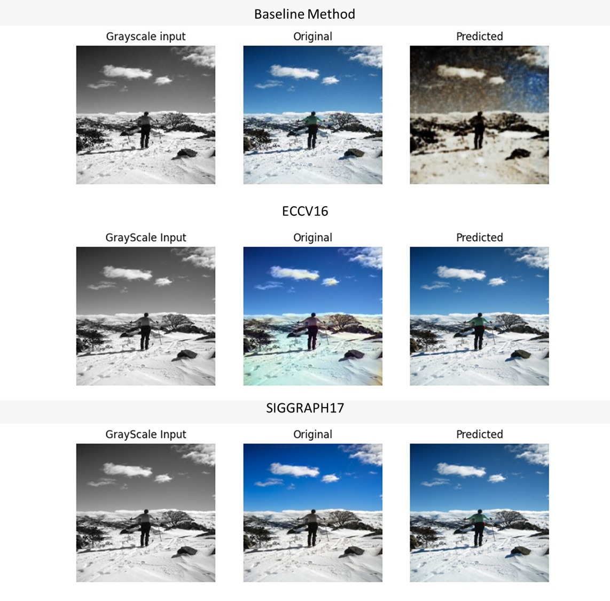

# BeyondAGrayscalePerception

## Baseline 
In order to run the file, you can add an argument --mode with 3 different configurations (Train, to train the model, Test, to evalaute de model and Demo to save the prediction of an image)

## Beta and Gamma Models

## ECCV16 and

## Saved Models
| Model | Route |
|----------|----------|
| Baseline   |  /home/lvchaparro/AML/PROYECTO/NEWCOLOR/CODIGO FINAL/models/Baseline/modeloBaseline.pt   | 
| Gamma    | /home/lvchaparro/AML/PROYECTO/NEWCOLOR/CODIGO FINAL/models/gamma/betagammag.pt   | 
| Gamma (PL)    | Cell 8   | 
| Beta    | /home/lvchaparro/AML/PROYECTO/NEWCOLOR/CODIGO FINAL/models/beta/betagammab.pt   | 
| Beta (PL)    | Cell 8   | 

